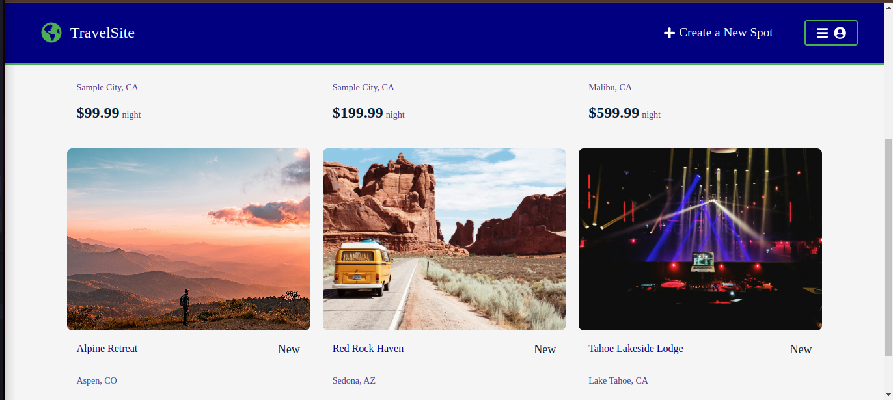
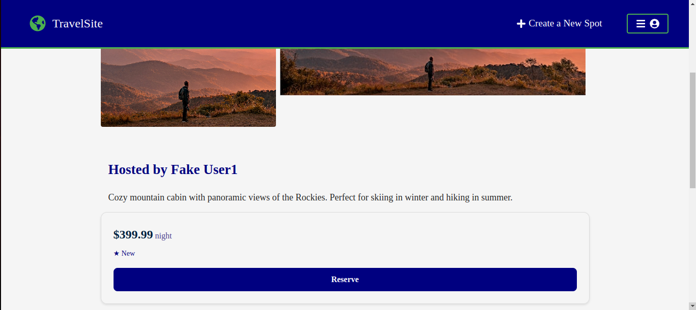
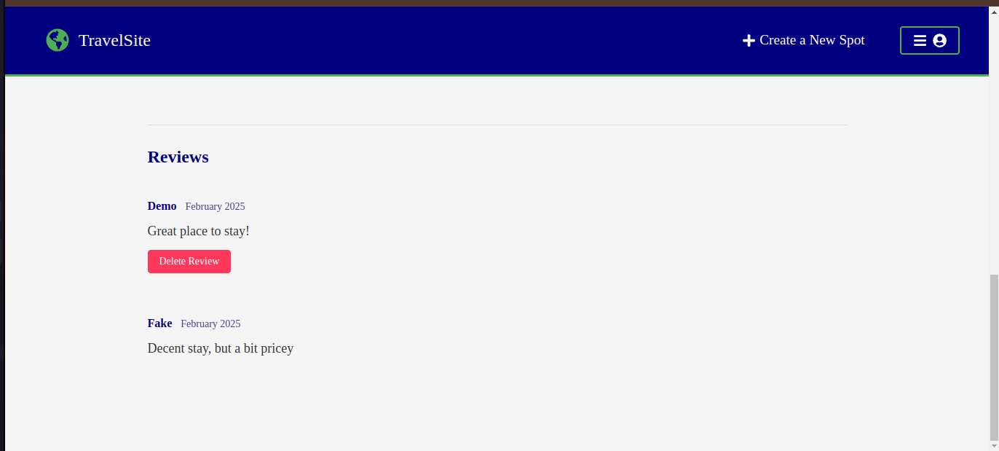
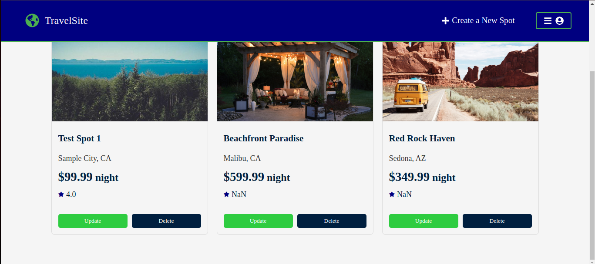

# TravelSite Frontend

## About
TravelSite is a modern web application inspired by Airbnb, built with React and Redux. It provides a platform for users to list their properties and book accommodations, complete with reviews and ratings.

## Technologies Used
- React 18
- Redux Toolkit for state management
- React Router for navigation
- Modern CSS with Flexbox and Grid
- Vite as the build tool

## Key Features

### User Authentication
- User signup with validation
- User login with validation
- Demo user login for easy testing
- Protected routes for authenticated users

### Spots (Properties)
- View all available spots
- Detailed view of individual spots
- Create new spots with multiple images
- Update existing spots
- Delete spots (owner only)
- Manage your spots dashboard

### Reviews and Ratings
- View spot reviews and average ratings
- Post reviews with star ratings
- Delete your own reviews
- Validation to prevent duplicate reviews
- Owner cannot review their own spots

## Getting Started

### Prerequisites
- Node.js 16.x or higher
- npm 8.x or higher

### Installation
1. Clone the repository
```bash
git clone https://github.com/carissab96/TravelSite.git
cd TravelSite/frontend
```

2. Install dependencies
```bash
npm install
```

3. Start the development server
```bash
npm run dev
```

## Project Structure
```
src/
├── components/         # React components
│   ├── Navigation/     # Navigation and header components
│   ├── Spots/         # Spot-related components
│   ├── Reviews/       # Review components
│   └── ...           
├── store/             # Redux store and slices
├── context/           # React context if used
└── utils/             # Utility functions
```

## Screenshots

### Homepage

*Landing page showing featured spots*

### Spot Details

*Detailed view of a property with images and description*


*Reviews and ratings section*

### Manage Spots

*Dashboard for managing your properties*

## Coding Standards and Conventions

### Component Structure
```jsx
// ComponentName.jsx
import { useState, useEffect } from 'react';
import { useDispatch, useSelector } from 'react-redux';
import './ComponentName.css';

function ComponentName() {
    // 1. Hooks
    const dispatch = useDispatch();
    const [localState, setLocalState] = useState();

    // 2. Redux selectors
    const data = useSelector(state => state.slice.data);

    // 3. Effects
    useEffect(() => {
        // Side effects here
    }, [dependencies]);

    // 4. Event handlers
    const handleEvent = () => {
        // Handler logic
    };

    // 5. Render
    return (
        <div className="component-name">
            {/* JSX */}
        </div>
    );
}

export default ComponentName;
```

### CSS Conventions
- Use BEM naming convention: `block__element--modifier`
- Mobile-first responsive design
- CSS variables for colors and common values:
```css
:root {
    --primary-color: #ff385c;
    --secondary-color: #00a699;
    --text-color: #222;
    --error-color: #ff0000;
    --spacing-unit: 8px;
}
```

### State Management
- Use Redux for global state (auth, spots, reviews)
- Use local state for UI-specific state (forms, modals)
- Follow Redux Toolkit patterns:
  - Use createSlice for reducers
  - Use createAsyncThunk for API calls
  - Normalize state shape for entities

### Error Handling
- Consistent error message format
- Validation feedback in forms
- Loading states for async operations
- Graceful fallbacks for missing data

### Code Organization
- Group related components in feature folders
- Separate business logic from UI components
- Reusable components in shared directory
- Constants in separate files

## Contributing
If you'd like to contribute, please fork the repository and create a pull request, or open an issue for discussion.

## License
This project is licensed under the MIT License.

The MIT License is a permissive free software license that puts only very limited restriction on reuse and has, therefore, reasonable license compatibility. It permits reuse within proprietary software provided all copies of the licensed software include a copy of the MIT License terms and the copyright notice.

See the [LICENSE](../LICENSE) file in the project root for the full license text.

---
